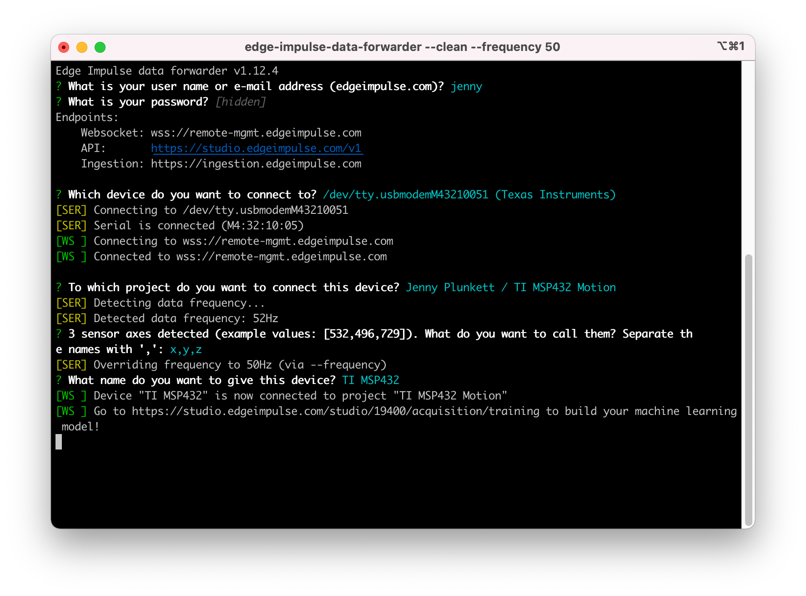
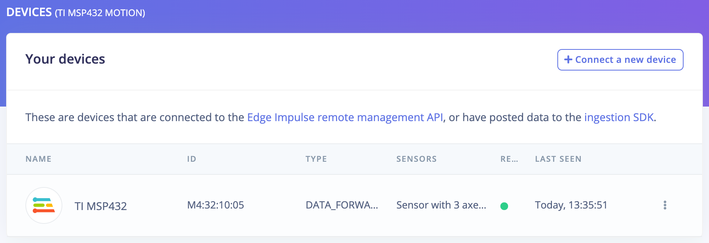
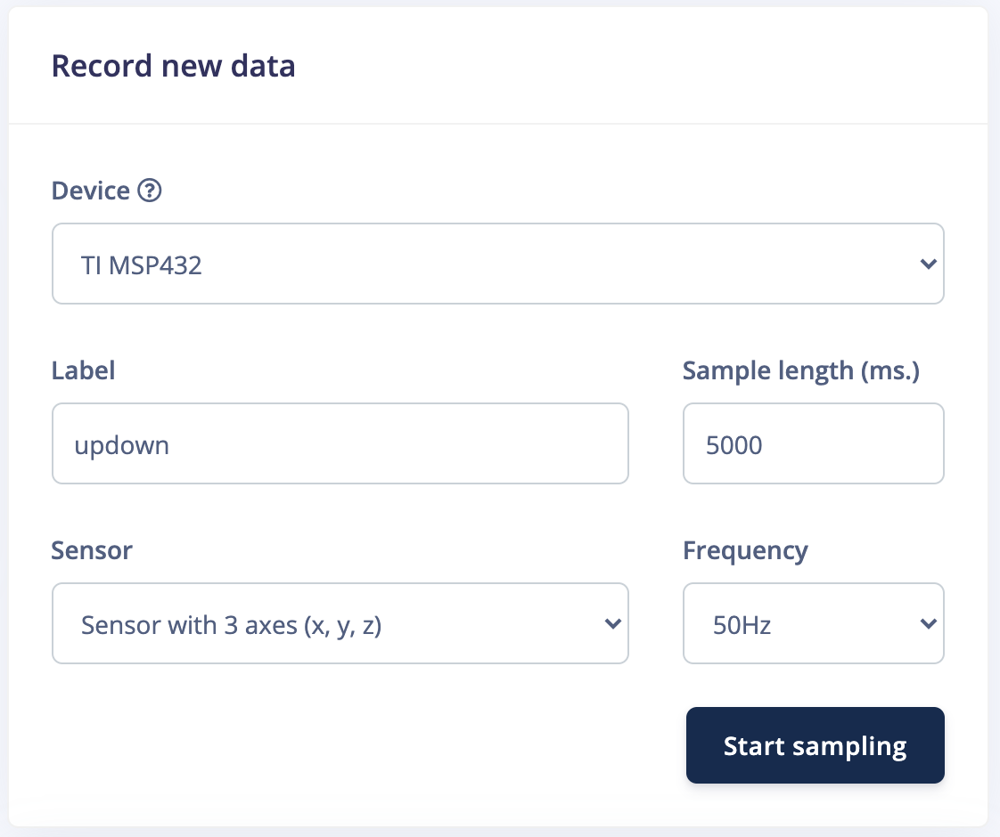

# TI MSP432™ MCU Motion Recognition Demo with Edge Impulse

This repository contains an example for the TI MSP432™ MCU with Educational BoosterPack MKII for motion recognition with Edge Impulse.

## Pre-requisites

- Purchase a [SimpleLink™ MSP432P401R high-precision ADC LaunchPad™ Development Kit](https://www.ti.com/tool/MSP-EXP432P401R) & [Educational BoosterPack MKII](https://www.ti.com/tool/BOOSTXL-EDUMKII) (the BoosterPack is required to obtain access to accelerometer data)
- Create an [Edge Impulse Account](https://studio.edgeimpulse.com/)
- Create a new Edge Impulse project
- Install the [Edge Impulse CLI](https://docs.edgeimpulse.com/docs/cli-installation)
- Install the [Arduino IDE](https://www.arduino.cc/en/software) - and install the TI Energia board package: 
    - Select 'Preferences' > 'Additional Boards Manager URLs', add the following URL `http://s3.amazonaws.com/energiaUS/packages/package_energia_index.json`
    - Select 'Tools' > 'Board' > 'Boards Manager...', search for and install **Energia MSP432 EMT RED boards**
- Clone this repository locally: `git clone https://github.com/edgeimpulse/example-ti-msp432-mcu-motion.git`

## Collect accelerometer motion data

Follow the instructions below to record motion data samples from the TI MSP432/Educational BoosterPack accelerometer and upload them directly into your Edge Impulse project.

Alternatively, you can instead use data that has already been collected from the [Continuous motion recognition tutorial](https://docs.edgeimpulse.com/docs/continuous-motion-recognition) by cloning the [Edge Impulse tutorial project](https://studio.edgeimpulse.com/public/14299/latest) into your account (select the **Clone this project** button on the top right). 

1. Open the file `get_msp432_motion_data/get_msp432_motion_data.ino` in your Arduino IDE
1. Select the **RED LaunchPag w/ msp432p401r EMT (48MHz)** board and port from the 'Tools' menu
1. Compile and flash the program onto your board
1. Open a command line window and run `edge-impulse-data-forwarder --frequency 50`,  select your board and project settings in your Edge Impulse account:
    
    - Select the **Devices** tab on your Edge Impulse project dashboard and you should see your TI MSP432 board connected with a green dot
    
1. Select the **Data acquisition** tab on your Edge Impulse project dashboard and start collecting motion samples under 'Record new data':
    - I recorded ~13 minutes of training data and ~3 minutes of testing data, with 4 different types of motion classes: updown, wave, snake, and idle
    
    
## Create your impulse & classify motion data on the TI MSP432™ MCU

Now that you have gathered and uploaded your motion data samples into your Edge Impulse project, you can create your machine learning **Impulse design** to train a model to recognize various gestures from the accelerometer data on your device. 

If you cloned the existing [Edge Impulse Continuous motion recognition tutorial project](https://studio.edgeimpulse.com/public/14299/latest) into your account, the **Impulse design** step is already done for you, skip to the instructions below.

Otherwise, please follow the [Continuous motion recognition tutorial](https://docs.edgeimpulse.com/docs/continuous-motion-recognition#3-designing-an-impulse) to setup your machine learning **Impulse design** for your Edge Impulse project and then follow the instructions below.

1. Select the **Deployment** tab on your Edge Impulse project, select 'Arduino library' and then click **Build**
1. Open `ei_msp432_motion_example/ei_msp432_motion_example.ino` in your Arduino IDE
1. Select the **RED LaunchPad w/ msp432p401r EMT (48MHz)** board and port from the 'Tools' menu
1. Import your downloaded Arduino library into the Arduino IDE: 'Sketch' > 'Include Library' > 'Add .ZIP Library...' and select your Edge Impulse library then import it into your .ino file (for example, on line 2: `#include <tutorial_continuous_motion_recognition_inference.h>`)
1. Modify the `getAcceleration()` method if you are using the cloned [Edge Impulse Continuous motion recognition tutorial project](https://studio.edgeimpulse.csom/public/14299/latest) (see comments at line 63)
1. Compile and flash the program onto your board
    - **Note:** During compilation, if you get an error relating to `'vsnprintf' was not decalred in this scope`, add `#include <stdio.h>` to the following file in your imported Arduino library, for example: `Arduino/libraries/ei-tutorial_-continuous-motion-recognition-arduino-1.0.1/src/edge-impulse-sdk/porting/arduino/ei_classifier_porting.cpp` then re-compile and flash
1. View your TI MSP432's BoosterPack screen displaying the motion inferencing results every 2 seconds!
    

## Next steps

Now that you have created a machine learning motion recognition project with Edge Impulse and a TI MSP432™ MCU, you can follow the same process to create other machine learning projects with different sensors on the BoosterPack such as the temperature sensor or microphone. Here are a few tutorials you can follow:

- [Responding to your voice](https://docs.edgeimpulse.com/docs/responding-to-your-voice)
- [Recognize sounds from audio](https://docs.edgeimpulse.com/docs/audio-classification)
- [Continuous audio sampling](https://docs.edgeimpulse.com/docs/continuous-audio-sampling)
- [Running your impulse locally](https://docs.edgeimpulse.com/docs/running-your-impulse-locally-1)

Have further questions about Edge Impulse or want to show us the project you created? Make a post on our forum at https://forum.edgeimpulse.com/ or tag us on social media [@EdgeImpulse](https://twitter.com/EdgeImpulse)!
